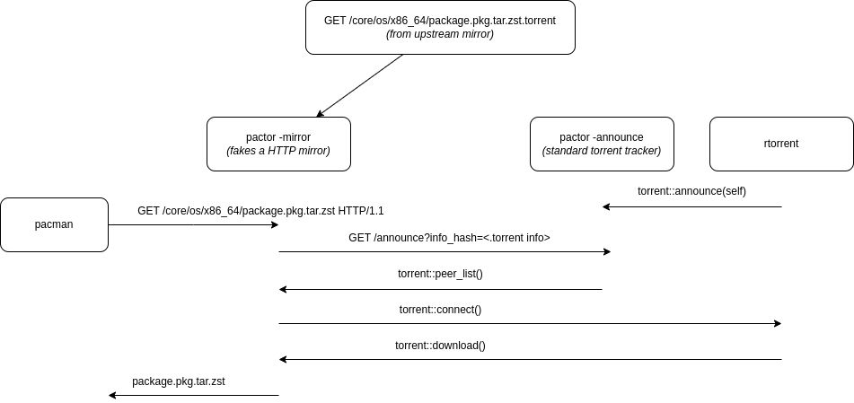

# pactor

A proof of concept for adding torrent downloads infront of pacman

# Prerequisite steps

1. Run `sudo init.sh` to create the required structure for pactor
   *(This will put the core.db etc in the right places, and create initial .torrent files of those files)*
2. Configure `rtorrent` according to [.rtorrent.rc](/.rtorrent.rc) *(or any other torrent client for initial seeding of packages)*
3. Comment out everything in `/etc/pacman.d/mirrorlist`
4. Add `Server = http://127.0.0.1:8001/$repo/$arch` at the top of `/etc/pacman.d/mirrorlist`
5. Add `XferCommand = /usr/bin/wget --timeout=60 --tries=3 -c -O %o %u` to `/etc/pacman.conf`'s `[options]` section
   *(We need to do this in order to get around pacman's internal timeout values that are non-configurable)*

There are PR's to pacman that addresses the timeout issue, once they get merged some of the steps can be reduced:
 * https://gitlab.archlinux.org/pacman/pacman/-/merge_requests/76 *(preferred, that way we can send a header to control pacman)*
 * https://gitlab.archlinux.org/pacman/pacman/-/merge_requests/74

# Running

1. `docker-compose up`
2. `rtorrent` and then load all torrents under `./pactor_torrents/*.torrent` *(these are the initial seedbox torrents that pactor will grab from)*
3. `pacman -Syu` should now request packages from `pactor mirror`, which will get the torrents from `rtorrent`.

# Overview

As mentioned, this is a proof of concept. It will be a bit shaky and not well polished.
But generally, this is what's going on:

# Rationale

This would be a practical solution to distribute package download across multiple peers, and offload mirrors.
It only makese sense if `pacman`'s internal timeouts are configurable. As we need to deal with potential slow downloads.

It also only really makes sense on fast internet connections where mirrors are a limiting factor.

Finally, the most useful scenario for this would be between mirrors themselves.
Where they could share the load dynamically between Tier levels. As we could reveal peers based on Tier's upstream level.